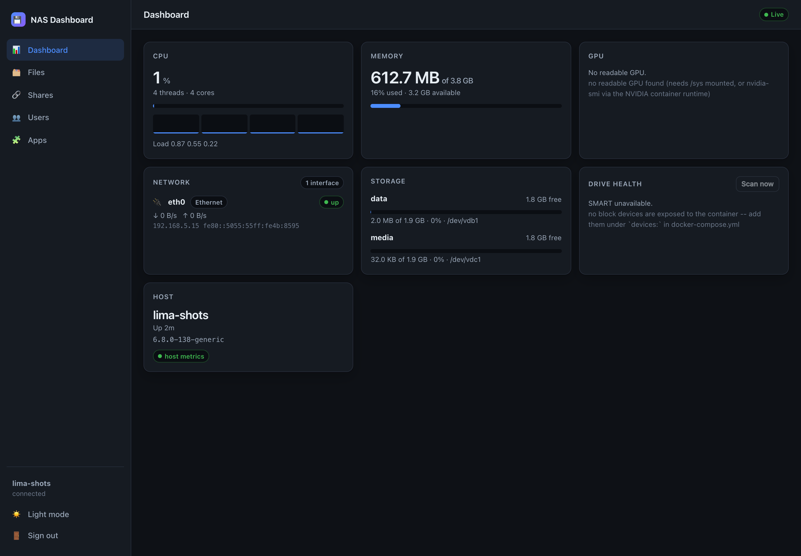
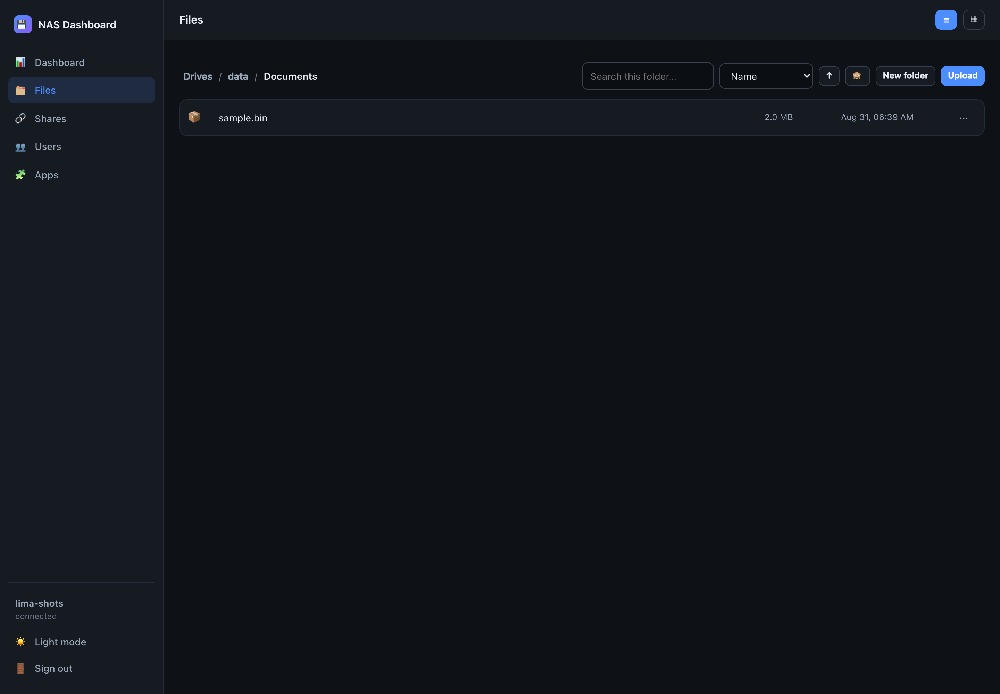
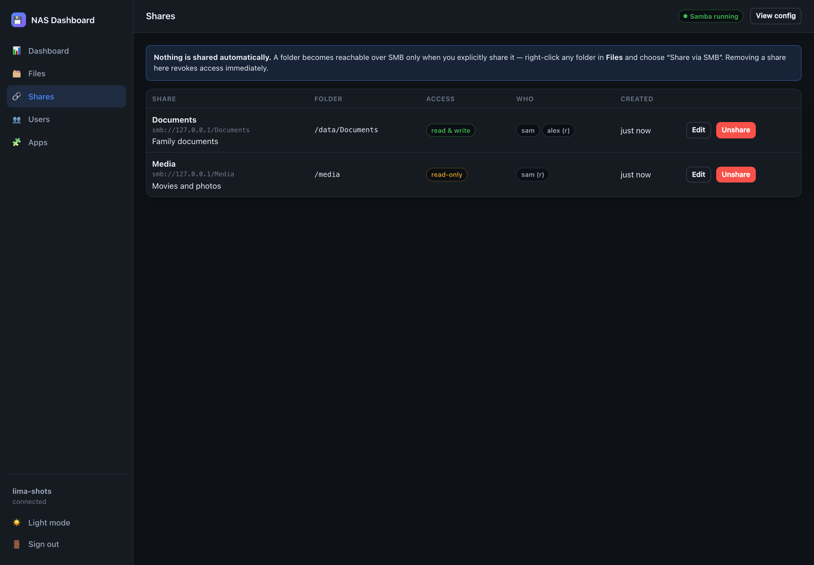
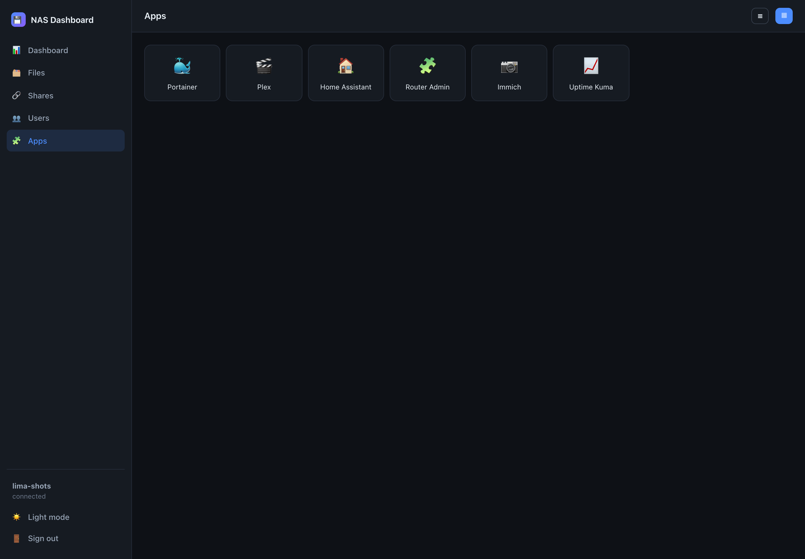

# nas-dashboard

A self-hosted NAS dashboard for a Linux box you own — file browser, **on-demand**
SMB sharing, and host system monitoring — in one Docker container. Built as a
CasaOS replacement for a NUC-as-NAS setup.

- **Nothing is shared by default.** A folder becomes reachable over SMB only
  when you right-click it and say so. See [Why sharing is opt-in](#why-sharing-is-opt-in).
- **The statistics describe the host, not the container.** This is the bug most
  dockerised monitoring tools ship with; see [Host stats, not cgroup stats](#host-stats-not-cgroup-stats).
- **Privileges are itemised, not hand-waved.** Every capability in the compose
  file has a stated reason and a stated consequence if you remove it.

---

## Screenshots

All captured against the running container on a real Ubuntu 24.04 host, showing
live host statistics and real shares — not mockups.

### Dashboard



### File browser

Files written from a Mac over SMB, visible immediately in the browser.



### Shares



### Apps



### Mobile


---

## Contents

- [What it does](#what-it-does)
- [Quick start](#quick-start)
- [Volume mounts, and why each one is there](#volume-mounts-and-why-each-one-is-there)
- [Privileges: what needs root, and what doesn't](#privileges-what-needs-root-and-what-doesnt)
- [Host stats, not cgroup stats](#host-stats-not-cgroup-stats)
- [Why sharing is opt-in](#why-sharing-is-opt-in)
- [How SMB sharing works under the hood](#how-smb-sharing-works-under-the-hood)
- [Connecting from your devices](#connecting-from-your-devices)
- [Apps launcher](#apps-launcher)
- [Backing up](#backing-up)
- [Migrating from CasaOS](#migrating-from-casaos)
- [Stack choice](#stack-choice)
- [Configuration reference](#configuration-reference)
- [Development](#development)
- [Troubleshooting](#troubleshooting)

---

## What it does

**Dashboard.** Live widgets over a single Server-Sent Events stream: CPU
(overall, per-core, temperature, load average), memory and swap, GPU where one
is readable, per-interface network throughput with **WiFi and Ethernet kept
distinct**, per-volume storage, and SMART health per physical drive with an
on-demand rescan.

**File browser.** Every mounted disk appears as its own top-level drive — not
one flattened tree. Navigate, upload (with progress), download, rename, move,
copy, delete, create folders, multi-select batch actions, recursive search,
sort by name/date/size/type, list or grid view, and in-browser preview for
images, video, audio, PDF and text.

**On-demand SMB sharing.** Right-click (or long-press on a phone) any folder →
**Share via SMB**. Choose a share name, read-only or read-write, and exactly
which users get access. The **Shares** page lists everything currently
exported, with one-click **Unshare** that genuinely revokes access.

**Users.** Create SMB accounts for family members, backed by real Samba users.
Each is created with `nologin` and no home directory, so an SMB credential can
never become a shell login.

**Apps.** A Homer-style launcher page listing links to anything on your
network — other Docker Compose apps, your router's admin page, whatever. List
or grid view. There is deliberately no "add app" button in the UI — see
[Apps launcher](#apps-launcher).

---

## Quick start

```bash
git clone https://github.com/codemastervy/nas-dashboard.git
cd nas-dashboard

cp .env.example .env
$EDITOR .env          # set ADMIN_PASSWORD -- the app refuses to serve without it

$EDITOR docker-compose.yml   # point the storage volumes at YOUR disks

docker compose up -d --build
docker compose logs -f
```

Then open `http://<your-nas>:8080`.

Generate a decent admin password with:

```bash
openssl rand -base64 24
```

---

## Volume mounts, and why each one is there

Every line in `volumes:` earns its place. Here is what each is for and what
breaks without it.

| Mount | Why | Without it |
|---|---|---|
| `/proc:/host/proc:ro` | Binds psutil to the host procfs explicitly | Correct anyway on *plain* Docker, but **wrong under lxcfs** (LXD/Proxmox), where `/proc/meminfo` is rewritten to the cgroup limit — see below |
| `/sys:/host/sys:ro` | CPU/GPU temperatures, and the WiFi-vs-Ethernet distinction | **Measured:** no temperature, no GPU, and every NIC misclassified as `virtual` — the Network widget goes empty |
| `./data:/data` | Share registry, user display names, SMART cache, session secret | **Your shares vanish** on the next container rebuild |
| `./data/samba:/var/lib/samba` | Samba's `tdbsam` passdb — the actual SMB password hashes | **Every SMB user disappears** on rebuild |
| `./data/shares.d:/etc/samba/shares.d` | The generated share config, on the host where you can read it | Works, but you can't inspect the config without entering the container |
| `/mnt/<disk>:/mnt/storage/<name>` | Your actual data. One line per disk | That disk doesn't appear in the browser |

### Mapping your disks

Each entry under `/mnt/storage/` becomes one drive in the UI. The name after
`/mnt/storage/` is the name you'll see:

```yaml
volumes:
  - /mnt/data:/mnt/storage/data          # appears as "data"
  - /mnt/media:/mnt/storage/media        # appears as "media"
  - /srv/backups:/mnt/storage/backups    # appears as "backups"
```

Find your real mountpoints with:

```bash
lsblk -o NAME,SIZE,FSTYPE,MOUNTPOINT
```

> **Do not mount `/`.** The dashboard can delete anything it can see. Mount the
> specific disks and directories you intend to manage, and nothing else.

Read-only is supported and behaves correctly — append `:ro` and the browser
marks the volume read-only and refuses writes:

```yaml
  - /mnt/archive:/mnt/storage/archive:ro
```

---

## Privileges: what needs root, and what doesn't

Being straight about this, because "runs rootless" is easy to claim and rarely true.

### This container runs as root, and that is not optional

**`smbd` requires root.** It binds port 445 (privileged), and — the part that
actually matters — it `setuid`s per session to the connecting user so the
kernel enforces per-user file permissions. That is *how* "Sam gets read-only,
Alex gets read-write" is real rather than cosmetic. There is no rootless smbd
that still does per-user access control.

Consequences, stated plainly:

- The container can read and write every path you mount into it.
- A remote-code-execution bug in this app is a root compromise of those mounts.
- With `network_mode: host`, it shares the host's network namespace.

**Mitigations that are actually in place:**

- Every filesystem path is resolved and containment-checked against its volume
  root before any operation (`backend/app/services/fs.py`), so a crafted path
  cannot escape a mount.
- All external commands are invoked as argument lists, never through a shell.
- Admin authentication is on by default and the app **refuses to serve the API**
  if `ADMIN_PASSWORD` is unset.
- The generated Samba config is validated with `testparm` and rolled back if it
  does not parse.

**If you want the API rootless:** run the dashboard without Samba
(`ENABLE_NMBD=false`, no `network_mode: host`, `user: "1000:1000"`) and point
it at a separate Samba host. On-demand sharing will not work in that
configuration — the app has to be able to write Samba's config and signal
`smbd`. That is a genuine trade-off, not something a flag can paper over.

### `network_mode: host`

Needed for two things:

1. **Samba on the LAN.** Port 445 and NetBIOS discovery (broadcast) do not
   survive a bridge NAT intact.
2. **Correct network statistics.** Inside a bridge network the container sees
   only its own `veth`, so throughput and the WiFi/Ethernet split would both be
   fiction.

Trade-off: the API listens on every host interface. Put a reverse proxy or a
firewall rule in front if the host is internet-facing.

### `cap_add: [SYS_RAWIO, SYS_ADMIN]` + `devices:` — SMART only

Reading SMART means issuing ATA/NVMe pass-through ioctls directly to the block
device. That needs the device node in the container **and** `CAP_SYS_RAWIO`
(NVMe also wants `CAP_SYS_ADMIN`). File permissions alone are not enough.

**This block is entirely optional.** Comment it out and the dashboard shows
SMART as unavailable with the reason, and everything else keeps working. It is
the only feature that needs these capabilities.

---

## Host stats, not cgroup stats

This is the failure mode the project was built to avoid, so it gets its own
section — including what testing actually showed, which is more nuanced than
the usual advice.

### The problem

A container can be made to see its own limits rather than the machine's. A
monitoring tool that reads the wrong source reports things like "500 MB of
512 MB memory used" while describing its own cgroup, not your NAS.

### What this app does

It binds psutil to a read-only bind mount of the host's procfs at startup:

```python
psutil.PROCFS_PATH = "/host/proc"      # backend/app/services/hostproc.py
```

and reads the things procfs doesn't cover from the host's sysfs by hand,
because **psutil has no `SYSFS_PATH` equivalent** and finds nothing useful
inside a container:

- CPU temperature — `/host/sys/class/hwmon/*/temp*_input`, falling back to thermal zones
- WiFi vs Ethernet — presence of `phy80211` on the interface, and whether the
  device resolves under `devices/virtual/net` (which is how `docker0`, bridges
  and `veth` pairs are excluded). Interface *names* are never trusted:
  `wlp2s0` and `eno1` are conventions, not guarantees.
- GPU — `/host/sys/class/drm/card*/device`

### What testing actually showed

Measured on Ubuntu 24.04 / Docker 29.7.2, running the container capped at
`--memory=512m` on a 4 GB host ([`TEST_RESULTS.md`](TEST_RESULTS.md) has the
full transcript):

| | with both binds | with neither bind |
|---|---|---|
| `memory.total` | 4093878272 ✅ | 4093878272 ✅ |
| `cpu.cores_logical` | 4 ✅ | 4 ✅ |
| CPU temperature | read from host hwmon | **`null`** ❌ |
| `eth0` classified as | **`ethernet`** ✅ | **`virtual`** ❌ |
| physical NICs shown | 1 | **0 — widget empty** ❌ |
| GPU detection | possible | impossible ❌ |

The honest conclusion, which differs from the folklore:

- **`/host/sys` is load-bearing.** Without it the network widget is not merely
  degraded, it is *empty*, because the container's own `eth0` resolves under
  `devices/virtual/net` and is correctly-but-uselessly classified as virtual.
  Temperatures and GPU disappear entirely.
- **`/host/proc` is defensive, not decisive on plain Docker.** On a stock
  Docker host, `/proc/meminfo` and `/proc/stat` are *already* the host's — they
  are not namespaced — so memory and CPU come out right either way. The bind
  matters when something virtualises procfs: **lxcfs**, standard on LXD and
  common on Proxmox, rewrites `/proc/meminfo` to the cgroup limit, and a
  container there would report its slice as the machine. Binding explicitly
  costs nothing and removes the ambiguity.

Anyone telling you the `/proc` mount is what fixes cgroup-vs-host reporting on
plain Docker is repeating something they have not measured. It is still worth
having; it is just not the part doing the work in the common case.

### Verifying it on your own machine

The dashboard shows a `host metrics` / `container metrics` badge on the Host
card, and the API reports it directly:

```bash
curl -s localhost:8080/api/health | jq .host_proc_bound     # expect: true
```

Compare against the host — these should match:

```bash
free -b | awk '/Mem:/ {print "host total:", $2}'
nproc
curl -s -b cookies.txt localhost:8080/api/system/stats \
  | jq '{mem: .memory.total, cpus: .cpu.cores_logical, host: .host.hostname}'
```

If `/host/proc` is missing the app does not quietly guess: it logs a warning at
startup and the UI shows a banner saying so.

## Why sharing is opt-in

**No folder is ever shared by default.** The share registry starts empty. There
is no filesystem scan, no auto-export, no "share everything under /mnt"
convenience path. A share exists only because a person chose a folder, named
it, picked who gets access, and confirmed.

This is a deliberate security design choice:

- **A NAS holds everything.** Tax records and holiday photos sit on the same
  disk. Default-share means one mistake exposes the lot.
- **SMB on a home LAN is reachable by everything on that LAN** — guest phones,
  a smart TV, an IoT device with firmware from 2019. The blast radius of an
  accidental share is the whole network, not just the people you meant.
- **Opt-in makes the share list meaningful.** The Shares page is a complete
  list of everything exposed, because there is no other way for a share to come
  into existence.

Unsharing is equally real: the share section is removed from the config, Samba
reloads, and any session still attached to it is closed with
`smbcontrol smbd close-share`. It is not hidden in the UI while remaining
mounted — see [`TEST_RESULTS.md`](TEST_RESULTS.md), where exactly that is
verified from a second machine.

---

## How SMB sharing works under the hood

**Your `smb.conf` is never rewritten by this app.** It carries one line:

```ini
include = /etc/samba/shares.d/dashboard-shares.conf
```

The dashboard owns that one generated file and nothing else. On every change it
regenerates the file **in full** from the JSON registry at `/data/shares.json`.

Regenerating rather than patching, because:

- The config can never drift out of step with what the UI shows.
- A hand-edit to `smb.conf` proper is never clobbered.
- Removing a share is deletion from a list, not a fragile "find and excise the
  right section" text edit.

Each change is then:

1. Rendered to a staging file.
2. Validated with `testparm` against a throwaway config that includes it.
3. Promoted into place only if it parses.
4. Applied with `smbcontrol all reload-config` — a **reload, not a restart**, so
   clients with an open session on another share keep it. Someone mid-copy is
   not interrupted because someone else shared a folder.
5. Rolled back automatically if Samba refuses it.

Per-user access uses `valid users` as the allow-list, with `write list` granting
write on a share that is otherwise read-only. A share with no members and no
guest access is intentionally unreachable rather than accidentally world-readable.

You can read the exact generated config from **Shares → View config**, or on the
host at `./data/shares.d/dashboard-shares.conf`.

---

## Connecting from your devices

Create a user under **Users**, share a folder, tick that user, then:

| Platform | How |
|---|---|
| **macOS** | Finder → `⌘K` → `smb://<nas>/<ShareName>` |
| **Windows** | Explorer → `\\<nas>\<ShareName>` |
| **iOS / iPadOS** | Files app → ⋯ → Connect to Server → `smb://<nas>` |
| **Android** | Any SMB client (CX File Explorer, Solid Explorer) → `<nas>` |
| **Linux** | `smb://<nas>/<ShareName>`, or `mount -t cifs //<nas>/<ShareName> /mnt -o username=<user>` |

SMB1 is disabled (`server min protocol = SMB2_10`) because it is obsolete and
unsafe. Encryption is `desired`, not `required` — forcing it breaks a number of
older phone SMB clients.

---

## Apps launcher

A **Homer**-style launcher page in the sidebar: a list or grid of links to
anything on your network — other Docker Compose apps, your router's admin
page, a Proxmox host, whatever. This is not a Docker integration and doesn't
inspect what's actually running; it's just a bookmarks page with icons.

### There is no "add app" button, on purpose

Every other page in this dashboard treats configuration as UI state, but this
one is a plain YAML file at `./data/apps.yml` — the same host directory as
everything else persistent. That's deliberate: this list is exactly the kind
of thing you set up once and barely touch, and a flat file is easier to back
up, script, or hand-edit over SSH than a form ever needs to be.

### Setting it up

1. SSH into the machine running the container (or open a terminal there), and
   go to wherever you keep `docker-compose.yml` for this project.
2. Create (or edit) `data/apps.yml` — that's the same `data/` directory the
   compose file already mounts to `/data`, so nothing extra needs mounting:

   ```bash
   nano data/apps.yml
   ```

3. Add one entry per app or link you want on the page:

   ```yaml
   apps:
     - name: Portainer
       icon: "🐳"
       url: http://192.168.1.10:9000
     - name: Plex
       icon: https://raw.githubusercontent.com/plexinc/pms-docker/master/plex.png
       url: http://192.168.1.10:32400/web
     - name: Router Admin
       url: http://192.168.1.1
   ```

4. Save, then open **Apps** in the sidebar and refresh the browser — no
   `docker compose restart` needed, the file is read fresh on every request.

Format reference:

- `name` and `url` are required; an entry missing either is skipped (not
  fatal to the rest of the file).
- `icon` is optional. Either an emoji/character, or a URL to an image —
  anything starting with `http://` or `https://` is rendered as an ``.
  With no icon, a generic 🧩 is shown.
- Invalid YAML is reported on the page itself, with the exact parser error
  and the path it looked at, rather than silently showing nothing — so if
  the page looks empty right after editing, check for a typo before assuming
  it didn't save.

---

## Backing up

`./data` is the only thing here you cannot regenerate. It holds the share
registry, your SMB users' **password hashes** (`data/samba`), the generated
Samba config, and the session secret. Lose it and every share and every family
member's login is gone.

```bash
# Stop first: Samba's tdb files are being written live, and copying them
# while smbd is running can capture a torn database.
docker compose stop
sudo tar czf nas-dashboard-data-$(date +%F).tar.gz ./data
docker compose start
```

Keep that archive somewhere that is **not** one of the disks this NAS serves.
It contains password hashes, so treat it as a secret: `chmod 600`, and do not
drop it in a shared folder.

To restore, put `./data` back beside `docker-compose.yml` and
`docker compose up -d` — shares and users come back exactly as they were, since
the container rebuilds Samba's config from the registry at startup.

---

## Migrating from CasaOS

**Back these up before you remove anything.**

### 1. Your existing Samba configuration

```bash
sudo cp -a /etc/samba /root/samba-backup-$(date +%F)
sudo cp -a /var/lib/samba /root/samba-passdb-backup-$(date +%F)
```

`/var/lib/samba` is the one people forget: it holds the `tdbsam` password
database. Lose it and every SMB user has to be recreated with a new password.

### 2. Write down what is currently shared

```bash
sudo testparm -s 2>/dev/null | grep -E '^\[|path ='
sudo pdbedit -L
```

Keep that output. It is the list of shares and users to recreate through the
dashboard — deliberately a manual step, so you re-confirm each share rather
than bulk-importing whatever CasaOS happened to be exporting.

### 3. Note your mountpoints

```bash
lsblk -o NAME,SIZE,FSTYPE,MOUNTPOINT,UUID
cat /etc/fstab
```

These become the `volumes:` entries. Check `/etc/fstab` actually mounts them at
boot — CasaOS sometimes mounts disks itself, and those mounts disappear with it.

### 4. Free up the ports

Both apps want 445, and CasaOS's web UI typically holds 80.

```bash
sudo systemctl stop  smbd nmbd
sudo systemctl disable smbd nmbd     # this container runs its own
sudo ss -tlnp | grep -E ':(80|445|139|8080)\b'
```

Leave the host's Samba **stopped but installed** until you have verified the new
shares work. Rolling back is then one `systemctl start smbd` away.

### 5. Reuse your existing SMB passwords (optional)

To keep family members' existing credentials, copy the old passdb into the
data volume before the first start:

```bash
mkdir -p ./data/samba
sudo cp -a /var/lib/samba/private ./data/samba/
```

Otherwise, recreate each user under **Users** — they will need the new password.

### 6. Then remove CasaOS

Only once the dashboard is up, your shares are recreated, and a second device
has successfully connected:

```bash
casaos-uninstall     # provided by CasaOS
```

> CasaOS also manages Docker containers for its app store. Those keep running —
> they are ordinary containers. `docker ps` before and after and compare, so
> nothing you cared about was tied to CasaOS's own compose files.

---

## Stack choice

**Backend: Python + FastAPI.** Chosen over Node specifically for this problem:

- **`psutil` solves the cgroup problem in one line.** `psutil.PROCFS_PATH =
  "/host/proc"` repoints every CPU, memory and network reading at the host.
  Node's `systeminformation` has no equivalent — you would hand-parse `/proc`
  for each metric, which is exactly where dockerised monitors get it wrong.
- **Samba management is subprocess and text work.** `smbpasswd`, `pdbedit`,
  `testparm`, `smbcontrol`, plus generating config. Python's `subprocess` with
  list-form arguments, timeouts, and stdin for passwords is direct and safe.
- **Streaming file I/O is native.** Uploads and downloads stream through the
  container without buffering whole files in memory.
- **FastAPI gives typed request validation** (Pydantic rejects a malformed
  share name before it reaches `smb.conf`) and an OpenAPI page at `/api/docs`
  for free.

**Frontend: React + Vite + TypeScript**, plain CSS with custom properties (no
Tailwind — one stylesheet is easier to read than utility soup for a dashboard
this size). Built to static files and served by the same FastAPI process, so
the deployment stays one container with no reverse proxy required.

---

## Configuration reference

| Variable | Default | Meaning |
|---|---|---|
| `ADMIN_PASSWORD` | *(none)* | **Required.** The API returns 503 until it is set |
| `AUTH_ENABLED` | `true` | Set `false` to disable the login entirely — full access to anything that can reach the port |
| `SESSION_SECRET` | *(generated)* | Session-cookie signing key; generated and persisted in `/data` if unset |
| `SESSION_TTL_SECONDS` | `1209600` | Session lifetime (14 days) |
| `STATS_INTERVAL` | `2.0` | Seconds between live samples |
| `ENABLE_SMART` | `true` | SMART widget; degrades gracefully when unavailable |
| `ENABLE_GPU` | `true` | GPU widget; degrades gracefully when no GPU is readable |
| `ENABLE_NMBD` | `true` | NetBIOS discovery; off means connect by IP/hostname only |
| `STORAGE_ROOT` | `/mnt/storage` | Where mounted drives are expected |
| `DATA_DIR` | `/data` | Persistent application state |
| `HOST_PROC` | `/host/proc` | Host procfs bind mount |
| `HOST_SYS` | `/host/sys` | Host sysfs bind mount |
| `LOG_LEVEL` | `INFO` | Python log level |

API documentation is served at `/api/docs`.

---

## Development

```bash
# Backend, against a real host
cd backend
python -m venv .venv && source .venv/bin/activate
pip install -r requirements.txt
HOST_PROC=/proc HOST_SYS=/sys STORAGE_ROOT=/tmp/storage DATA_DIR=/tmp/nasdata \
  ADMIN_PASSWORD=dev uvicorn app.main:app --reload --port 8080

# Frontend, proxying /api to the above
cd frontend
npm install
npm run dev        # http://localhost:5173
```

Samba features need the container — `smbd` and friends are not in the dev
environment.

---

## Troubleshooting

**"ADMIN_PASSWORD is not set" / every API call returns 503.**
Set it in `.env` and `docker compose up -d`. The app fails closed on purpose: an
open dashboard hands out the whole filesystem.

**CPU or memory look wrong / the UI shows a "container metrics" badge.**
`/proc:/host/proc:ro` is missing from `volumes:`. See
[Host stats, not cgroup stats](#host-stats-not-cgroup-stats).

**SMART says unavailable.**
Check `devices:` lists your real disks (whole devices, not partitions) and that
`cap_add` includes `SYS_RAWIO`. The UI states the specific reason. Note that
virtual disks (VMs, some USB bridges) genuinely do not support SMART.

**A share appears in the list but clients cannot see it.**
Check `docker compose logs | grep smbd`, and compare `registry_shares` with
`active_shares` in `GET /api/shares` — a mismatch means smbd did not reload.

**Port 445 already in use.**
The host's own Samba is still running: `sudo systemctl stop smbd nmbd`.

**No drives in the file browser.**
Nothing is mapped into `/mnt/storage/`. See
[Mapping your disks](#mapping-your-disks).

---

## Licence

MIT.
